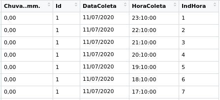
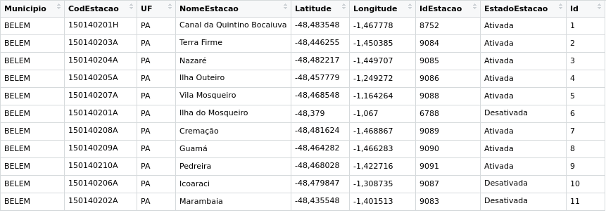

# pluvcemaden

# Descrição

Robô que permite a coleta de dados de estações pluviométricas instaladas em alguns municípios do estado do Pará. As estações são gerenciadas pelo Centro Nacional de Monitoramento e Alertas de Desastres Naturais ([CEMADEN](http://www.cemaden.gov.br/)). O CEMADEN possui um [mapa interativo](http://www.cemaden.gov.br/mapainterativo/#) que permite visualizar os dados obtidos pelas estações a cada hora. Este robô obtêm os dados da página do CEMADEN podendo ser modificado para obter dados de outras estações, sob a gestão do CEMADEN, localizadas em diversas regiões do país. 

# Exemplos de uso

É possível utilizar os dados obtidos por este robô para:

- Análise de dados
- Predições
- Uso em dashboards mais elaborados

# Uso

É necessário instalar os pacotes:

```
install.packages('rvest')
install.packages('hms')
install.packages('lubridate')
install.packages('xlsx')
install.packages('readr')
install.packages('stringr')
install.packages('dplyr')
```

A função principal se chama **cemaden.pluv.data(location)** em que:
- **location:** nome do município que se deseja realizar a filtragem

Ela retorna uma lista com 2 elementos:
- **data_st:** dados das coletas de cada estação
- **info_st:** informações sobre cada estação

```
data <- cemaden.pluv.data()
glimpse(data)
List of 2
 $ data_st:'data.frame':	229 obs. of  5 variables:
  ..$ Chuva..mm.: chr [1:229] "0,00" "0,00" "0,00" "0,00" ...
  ..$ Id        : int [1:229] 1 1 1 1 1 1 1 1 1 1 ...
  ..$ DataColeta: chr [1:229] "11/07/2020" "11/07/2020" "11/07/2020" "11/07/2020" ...
  ..$ HoraColeta: chr [1:229] "23:10:00" "22:10:00" "21:10:00" "20:10:00" ...
  ..$ IndHora   : int [1:229] 1 2 3 4 5 6 7 8 9 10 ...
 $ info_st:'data.frame':	11 obs. of  9 variables:
  ..$ Municipio    : chr [1:11] "BELEM" "BELEM" "BELEM" "BELEM" ...
  ..$ CodEstacao   : chr [1:11] "150140201H" "150140203A" "150140204A" "150140205A" ...
  ..$ UF           : chr [1:11] "PA" "PA" "PA" "PA" ...
  ..$ NomeEstacao  : chr [1:11] "Canal da Quintino Bocaiuva" "Terra Firme" "Nazaré" "Ilha Outeiro" ...
  ..$ Latitude     : chr [1:11] "-48,483548" "-48,446255" "-48,482217" "-48,457779" ...
  ..$ Longitude    : chr [1:11] "-1,467778" "-1,450385" "-1,449707" "-1,249272" ...
  ..$ IdEstacao    : chr [1:11] "8752" "9084" "9085" "9086" ...
  ..$ EstadoEstacao: chr [1:11] "Ativada" "Ativada" "Ativada" "Ativada" ...
  ..$ Id           : int [1:11] 1 2 3 4 5 6 7 8 9 10 ...

```

O robô permite a gravação dos dados em um arquivo Excel (.xlsx) contendo duas planilhas:

- Coletas de cada estação:
  - Volume de chuva em mm
  - Data da coleta
  - Hora da coleta
  
- Dados sobre cada estação
  - Nome do município
  - Código da estação estabelecido pelo CEMADEN
  - Identificador da estação definido pelo CEMADEN
  - Estado (UF)
  - Nome do local em que a estação está instalada
  - Coordenadas (Latitude e Longitude)
  - Estado da estação (Ativada ou Desativada)

> Em ambas estruturas, tem-se a presença de um campo chamado Id para permitir a ligação entre elas. 

> É importante destacar que é possível ajustar o robô para salvar os dados em outros formatos de arquivos. 

A figura abaixo representa  parte da estrutura final com os dados de coletas de cada estação:



A figura abaixo representa a estrutura final com os dados sobre cada estação:



### Atenção!

Como se trata de dados coletados de uma página WEB, tem que se ter em mente que há a possibilidade dos responsáveis realizarem alguma modificação na estrutura da página, o que pode dificultar o funcionamento do robô. 

# Contribuições

A vida é um eterno aprendizado. Então, contribuições serão sempre bem-vindas. 

# Links:

- [Pluviômetros automáticos (CEMADEN)](http://www.cemaden.gov.br/pluviometros-automatico/)
